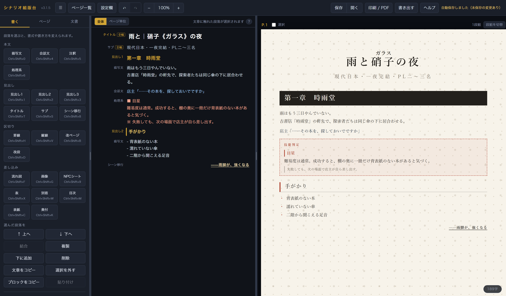

# シナリオ組版台

TRPG のシナリオを **書きながら、そのまま本の形に組む** ための道具です。

HTML ファイルが 1 つあるだけで動きます。インストールも、アカウント登録も、
サーバーとのやりとりもありません。原稿はあなたの手元から出ません。

左に原稿、右に紙面。打った字がそのまま、A4 の組み上がりとして隣に出ます。

---

## 使いかた

1. [`trpgscenarioeditor.html`](trpgscenarioeditor.html) を右クリックして保存する
   （または画面上の緑の **Code** → **Download ZIP**）
2. 保存したファイルをダブルクリックして、ブラウザで開く

それだけです。ローカルサーバーも、ビルドも要りません。

推奨ブラウザは **Chrome / Edge**（Chromium 系）です。Firefox・Safari でも書けますが、
印刷の改ページの位置がずれることがあります。

---

## できること

### 段落の書式

段落ごとに書式を選びます。`Ctrl` + `Shift` + 下のキーでも切り替わります。

| 区分 | 書式 | キー |
|---|---|---|
| 本文 | 描写文 / 会話文 / 注釈 / 処理系（囲み） | `0` `4` `5` `6` |
| 見出し | タイトル / サブ / 見出し1〜3 / シーン移行 | `T` `S` `1` `2` `3` `8` |
| 区切り | 罫線 / 縦線 / 改ページ / 改段 | `H` `V` `B` `D` |
| 差し込み | 画像 / 表 / 流れ図 / 別窓 / 目次 / NPCシート / 表紙 / 奥付 | `G` `X` `F` `W` `M` `9` `C` `K` |

「処理系」は判定などをくくる囲みで、枠線の形・左の太罫・地色・文字の大きさ・
色（朱・墨・藍・苔・金茶・灰）を選べます。

### 入れ子の書式（行の頭の印）

本文の中では、行の頭に印を置くと見た目が変わります。markdown と同じ書き方も通ります。

| 印 | なるもの | 打ちやすい合図 |
|---|---|---|
| `- ` | 箇条書き | `/kajou` `/list` |
| `1. ` | 番号つき | `/bangou` `/num` |
| `- [ ] ` | 選択肢（`- [x]` で済みの印） | `/sentaku` `/check` |
| `  - ` | 1つ内側の箇条書き | `/sagedan` `/indent` |
| `■` | 囲みの中の小見出し | `/midashi` `/head` |
| `◇` | ひとまわり小さい小見出し | `/komidashi` `/sub` |
| `※` | 注釈 | `/chushaku` `/note` |
| `> 技能：` | 判定の枠 | `/hantei` `/roll` |
| `「」` | 会話文（`名前「…」`で話し手つき） | `/kaiwa` `/talk` |
| `｜項目｜内容｜` | 表 | `/hyou` `/table` |
| `＠` | 別窓を開くボタン | `/betsumado` `/pop` |

`■` や `◇` は打つのが手間なので、行の頭で `/komidashi` と打って空白を押すと、
その場で印に化けます。化けたあとの原稿はふつうの印そのものなので、
紙面・書き出し・表の出力・文字数のどれにも影響しません。

### ルビ

`｜漢字《かんじ》` と書くと、ルビが振れます。`Ctrl` + `Shift` + `R` でも入ります。
見出し・会話文・画像の説明文など、文字が出るところならどこでも使えます。

### 表

行と列を足し引きでき、升目の中に段落をそのまま入れられます（表の中に囲みや箇条書きが置けます）。
表からは **ココフォリアのロール表** の文字列も出せます。

### 流れ図

箱を置いて線でつなぐ、分かれ道つきの図です。Figma のように自由に配置でき、
箱の形（四角・角丸・ひし形・端子・入出力）、大きさ、二段分け、余白、色を選べます。
複数まとめて選んで、中央ぞろえ・横幅そろえ・余白均等がかけられます。

### 別窓

紙面には出さず、ボタンから開く補足のページを作れます。
NPC の裏設定、ハンドアウト、GM だけが読む注記などに使えます。
印刷と書き出しでは、巻末に「追記」としてまとめて付きます。

### NPC シート

名前・肩書き・能力値・技能などをまとめた囲みです。立ち絵も置けます。
**ココフォリアのコマ**を貼り付けて読み込むことも、逆にコマとして書き出すこともできます。

### 目次

何を載せるか（タイトル・見出し1〜3・サブ・シーン移行）を書式ごとに選べます。
さらに見出し 1 つずつに、

- 目次に出る文字（見出し本体とは別に決められます）
- 載せる／載せない（書式ごとの設定を上書きします）
- 目次での段さげ

を持たせられます。ページ番号と点線は出し入れできます。

### 紙面

- ページごとに 1 段組／2 段組
- 余白（天地・左右）と基準の文字の大きさ
- 表紙ページと奥付ページ
- ノンブル（ページ番号）と柱（決まり文句）、始まりの番号
- ページ一覧（`Ctrl` + `Shift` + `P`）

---

## 保存と書き出し

| | |
|---|---|
| **自動保存** | 打つたびにブラウザの中に控えます。閉じても次に開けば続きから |
| **作品** | シナリオをいくつでもブラウザの中に置いておけます。一覧から開く・新しく作る・複製・削除 |
| **保存**（`Ctrl` + `S`） | `.json` ファイルとして手元に落とします。これが原稿の本体です |
| **開く** | 落とした `.json` を、新しい作品として読み込みます（いまの作品は上書きしません） |
| **印刷 / PDF** | ブラウザの印刷画面から PDF にできます |
| **書き出す** | 配布用の**閲覧 HTML** を 1 ファイルで作ります。渡された人は開くだけで読めます |

起動すると作品の一覧が出ます。最後に開いていた作品が選ばれているので、
そのまま **開く**（または `Enter`）で続きから書けます。

> 作品はブラウザの IndexedDB に置きます。画像やフォントを入れた大きな原稿でも自動保存できます。
> ただしブラウザのデータを消すと作品も消えるので、大切な原稿は **保存** でファイルにも残してください。
>
> v3.1 までの自動保存は、はじめて v3.2 を開いたときに作品として引き継ぎます。
> 引き継いだあとは古い保存場所から消すので、古い版の組版台ではその原稿が見えなくなります
> （消す前に確認が出ます）。
>
> IndexedDB が使えないブラウザでは、これまでどおり 1 作品だけを保存します。
> その場合は画像やフォントで自動保存の容量（4MB）を超えることがあり、画面下に知らせが出ます。

---

## 覚えておくと早いキー

| キー | すること |
|---|---|
| `Ctrl` + `Shift` + 書式のキー | 選んだ段落の書式を変える |
| `Ctrl` + `Z` / `Ctrl` + `Y` | 元に戻す / やり直す |
| `Ctrl` + `S` | ファイルに保存 |
| `Ctrl` + `C` / `Ctrl` + `V` | 段落まるごとコピー・貼り付け（文字を選んでいないとき） |
| `Ctrl` + `Alt` + `Shift` + `C` / `V` | 同じことを確実に |
| `Ctrl` + `Shift` + `R` | ルビを振る |
| `Ctrl` + `Shift` + `[` / `]` | 字下げを戻す / 下げる |
| `Ctrl` + `Shift` + `P` | ページ一覧 |
| `Ctrl` + `0` | 紙面を幅に合わせる |
| `Ctrl` + `+` / `-`、`Ctrl` + `Shift` + `↑` `↓` | 紙面を大きく / 小さく |
| `Ctrl` + ホイール | 同じく大きく / 小さく |
| `Esc` | 選択を外す |

画面右上の **ヘルプ** に、もっと詳しい説明が入っています。

---

## 中身について

- 素の HTML / CSS / JavaScript だけで書かれた **1 ファイル**です。
  ビルドも、外部のライブラリも、通信もありません。
- 紙面の見た目を決める CSS は `DOC_CSS`（JavaScript の中の文字列）に集めてあり、
  編集画面と書き出し HTML の両方がこれを使います。だから**画面と書き出しが食い違いません**。
- 流れ図は、形と線を SVG で、文字を mm 指定の HTML で重ねて描いています。
- コメントは日本語で、「なぜそうしたか」を残す形で書いてあります。

直したいところがあれば、ブラウザで開いてそのまま読めます。

---

## 版

画面右上に出ている文字が、いま動いている版です。
不具合を知らせてくださるときは、この文字も一緒に教えてください。

**いまの版：v3.2.0**

---

## ライセンス

[CC0 1.0 全世界](LICENSE)（パブリックドメイン）。

著作権を放棄しています。**表示も断りもなしに**、自由に使い、書き換え、
配ってかまいません。商用でも、あなたの卓のためだけでも、同じです。
